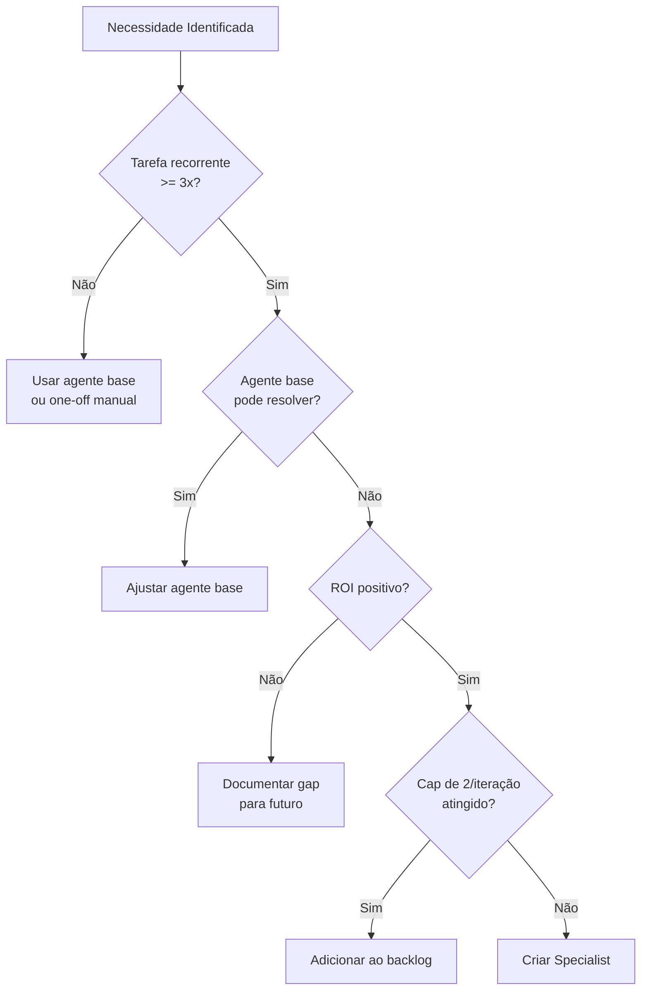
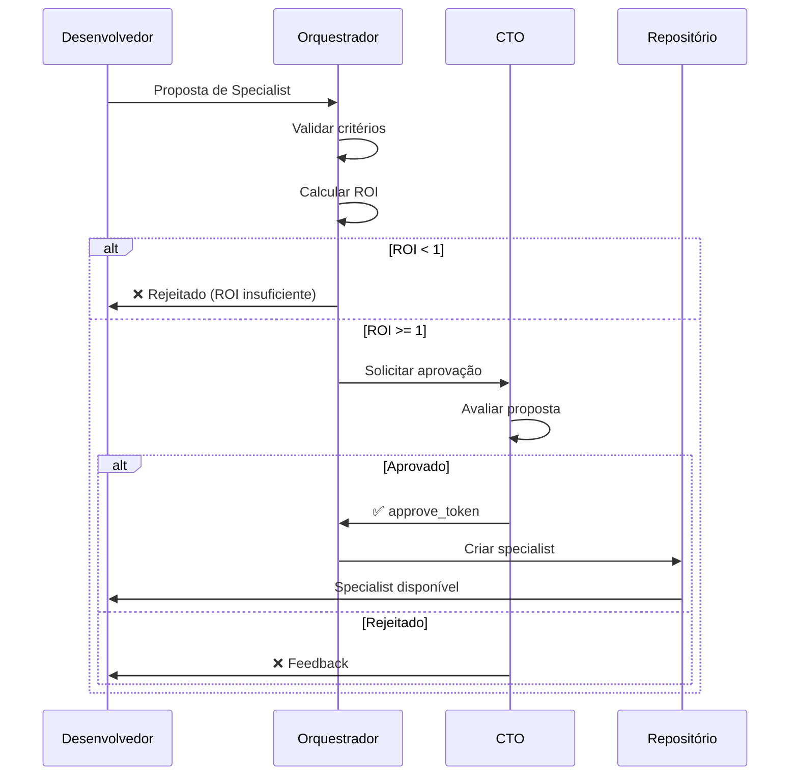
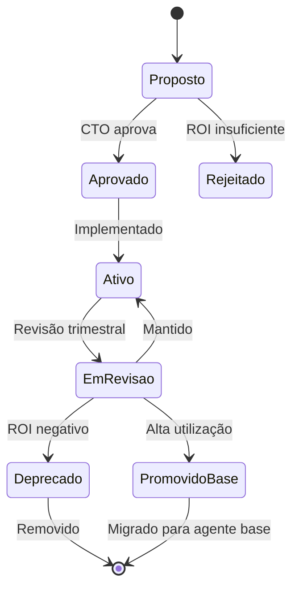

# Protocolo de Specialists

> **Template padrão tech-agentes** — Governança para criação e gestão de agentes especialistas.
> **Versão**: 1.0.0 | **Última atualização**: 2026-01-18

---

## 1. Visão Geral

**Specialists** são agentes criados sob demanda para resolver problemas específicos que os agentes base não cobrem adequadamente. A criação de specialists é controlada para evitar proliferação desnecessária e manter a governança do sistema.

### 1.1 Princípios

1. **ROI Comprovado**: Só criar specialist se o benefício superar o custo de manutenção
2. **Cap por Iteração**: Máximo de 2 specialists por sprint/iteração
3. **Governança CTO**: Aprovação obrigatória para specialists em stage/prod
4. **Ciclo de Vida**: Specialists podem ser promovidos a base ou aposentados

---

## 2. Critérios de Criação

### 2.1 Quando Criar um Specialist

✅ **Criar quando**:
- Tarefa recorrente (≥3 ocorrências) não coberta por agentes base
- Domínio específico requer conhecimento especializado
- Qualidade dos agentes base é insuficiente para o caso
- ROI estimado é positivo (ver seção 3)

❌ **NÃO criar quando**:
- Tarefa é one-off (única ocorrência)
- Agente base pode ser ajustado/melhorado
- Duplicaria funcionalidade existente
- Custo de manutenção supera benefício

### 2.2 Árvore de Decisão



---

## 3. Cálculo de ROI

### 3.1 Fórmula

```
ROI = (Benefício - Custo) / Custo

Benefício = (Tempo_economizado × Custo_hora × Frequência) + Qualidade_adicional
Custo = Criação + Manutenção_anual + Overhead_contexto
```

### 3.2 Exemplo de Cálculo

```yaml
specialist_proposal:
  name: "specialist-etl-healthcare"

  beneficio:
    tempo_economizado_horas: 4
    frequencia_mensal: 8
    custo_hora_dev: 150
    qualidade_adicional_valor: 500  # Redução de erros
    beneficio_anual: (4 * 8 * 12 * 150) + (500 * 12) = 63.600

  custo:
    criacao_horas: 16
    custo_criacao: 2.400
    manutencao_anual_horas: 8
    custo_manutencao: 1.200
    overhead_contexto: 500  # Tokens extras por chamada
    custo_total: 4.100

  roi: (63.600 - 4.100) / 4.100 = 14.5x  # ✅ ROI positivo
```

### 3.3 Threshold de Aprovação

| ROI | Decisão |
|-----|---------|
| < 1x | ❌ Não criar |
| 1-3x | ⚠️ Avaliar com CTO |
| > 3x | ✅ Aprovar criação |

---

## 4. Processo de Criação

### 4.1 Workflow



### 4.2 Checklist de Criação

```markdown
## Checklist: Novo Specialist

### Pré-requisitos
- [ ] Critérios de criação atendidos (seção 2)
- [ ] ROI calculado e documentado
- [ ] Cap de 2/iteração não atingido
- [ ] Aprovação do CTO obtida (se stage/prod)

### Documentação
- [ ] Mandato definido
- [ ] Entradas e saídas especificadas
- [ ] Limitações documentadas
- [ ] Handoffs mapeados

### Implementação
- [ ] Arquivo criado em `agents/specialists/`
- [ ] Prompts em `prompts/specialists/` (se necessário)
- [ ] Golden sets em `evals/` para validação
- [ ] Testes de regressão passando

### Validação
- [ ] Testado em ambiente dev
- [ ] Métricas de qualidade registradas
- [ ] Aprovação final do CTO
```

---

## 5. Template de Specialist

### 5.1 Estrutura do Arquivo

```markdown
# Specialist: [Nome]

> **Tipo**: specialist
> **Versão**: 1.0.0
> **Criado em**: [DATA]
> **Aprovado por**: [CTO/NOME]
> **ROI estimado**: [Xx]

---

## Mandato

[Descrição clara e específica do que este specialist faz]

## Justificativa de Criação

- **Problema**: [Qual problema resolve]
- **Por que não agente base**: [Razão]
- **ROI**: [Cálculo resumido]

## Domínio de Atuação

- [Escopo 1]
- [Escopo 2]

## Limitações

- NÃO faz: [Limitação 1]
- NÃO faz: [Limitação 2]

## Entradas

| Input | Tipo | Obrigatório | Descrição |
|-------|------|-------------|-----------|
| [input1] | [tipo] | Sim/Não | [descrição] |

## Saídas

| Output | Tipo | Descrição |
|--------|------|-----------|
| [output1] | [tipo] | [descrição] |

## Handoffs

| Para | Quando | O que passa |
|------|--------|-------------|
| [agente] | [condição] | [dados] |

## Prompts Associados

- `prompts/specialists/[nome]_template.md`

## Golden Sets

- `evals/specialists/[nome]_golden.json`

## Métricas de Sucesso

| Métrica | Target | Atual |
|---------|--------|-------|
| Accuracy | >95% | [valor] |
| Latência P95 | <5s | [valor] |

## Histórico

| Versão | Data | Mudança |
|--------|------|---------|
| 1.0.0 | [data] | Criação inicial |
```

### 5.2 Exemplo Preenchido

```markdown
# Specialist: Healthcare ETL Validator

> **Tipo**: specialist
> **Versão**: 1.0.0
> **Criado em**: 2026-01-18
> **Aprovado por**: CTO
> **ROI estimado**: 14.5x

---

## Mandato

Validar e transformar dados de sistemas de saúde (HL7, FHIR) para
o data warehouse, garantindo compliance com regulações de saúde
e anonimização de dados sensíveis.

## Justificativa de Criação

- **Problema**: Integrações healthcare requerem conhecimento específico de
  padrões HL7/FHIR e regulações (HIPAA, LGPD para dados de saúde)
- **Por que não agente base**: Agente de integrações é generalista;
  healthcare tem requisitos únicos de compliance e formatos
- **ROI**: 14.5x (63.6k benefício / 4.1k custo anual)

## Domínio de Atuação

- Validação de mensagens HL7 v2.x
- Transformação FHIR R4
- Anonimização de PHI (Protected Health Information)
- Validação de compliance

## Limitações

- NÃO faz: Diagnósticos médicos
- NÃO faz: Integrações com sistemas não-healthcare
- NÃO faz: Armazenamento de dados (apenas transformação)

## Entradas

| Input | Tipo | Obrigatório | Descrição |
|-------|------|-------------|-----------|
| source_data | JSON/HL7/FHIR | Sim | Dados de origem |
| target_schema | JSON Schema | Sim | Schema de destino |
| anonymize | boolean | Não | Se deve anonimizar PHI |

## Saídas

| Output | Tipo | Descrição |
|--------|------|-----------|
| transformed_data | JSON | Dados transformados |
| validation_report | JSON | Relatório de validação |
| compliance_flags | JSON | Flags de compliance |

## Handoffs

| Para | Quando | O que passa |
|------|--------|-------------|
| qualidade_auditoria_testes | Sempre | validation_report |
| seguranca_compliance | PHI detectado | compliance_flags |

## Métricas de Sucesso

| Métrica | Target | Atual |
|---------|--------|-------|
| Accuracy | >99% | 99.2% |
| Latência P95 | <3s | 1.8s |
| Compliance rate | 100% | 100% |
```

---

## 6. Ciclo de Vida

### 6.1 Estados do Specialist



### 6.2 Revisão Trimestral

```markdown
## Checklist de Revisão

- [ ] ROI ainda positivo?
- [ ] Frequência de uso justifica manutenção?
- [ ] Qualidade dentro dos targets?
- [ ] Deve ser promovido a agente base?
- [ ] Deve ser aposentado?
```

### 6.3 Critérios de Promoção

| Critério | Threshold para Promoção |
|----------|-------------------------|
| Frequência de uso | >20x/mês por 3+ meses |
| Aplicabilidade | >3 projetos diferentes |
| Estabilidade | 0 bugs críticos em 3 meses |
| ROI | >10x sustentado |

---

## 7. Governança

### 7.1 Gates de Aprovação

| Ambiente | Aprovador | Requisitos |
|----------|-----------|------------|
| dev | Tech Lead | ROI > 1x, documentação básica |
| stage | CTO | ROI > 3x, testes passando |
| prod | CTO + approve_token | Todos os anteriores + golden sets |

### 7.2 Limites

| Limite | Valor | Justificativa |
|--------|-------|---------------|
| Specialists por iteração | 2 | Evitar proliferação |
| Specialists ativos total | 10 | Manter contexto gerenciável |
| Tempo máximo sem uso | 90 dias | Deprecar se não usado |

### 7.3 Auditoria

Todos os specialists devem:
- Ter logs de uso rastreáveis
- Reportar métricas para `observability/`
- Passar por revisão trimestral
- Ter documentação atualizada

---

## 8. Diretório de Specialists Ativos

> Atualizar conforme specialists são criados.

| Nome | Versão | Status | ROI | Criado | Próxima Revisão |
|------|--------|--------|-----|--------|-----------------|
| [nenhum ainda] | - | - | - | - | - |

---

## Histórico de Atualizações

| Data | Autor | Mudança |
|------|-------|---------|
| 2026-01-18 | CTO | Criação do protocolo |
