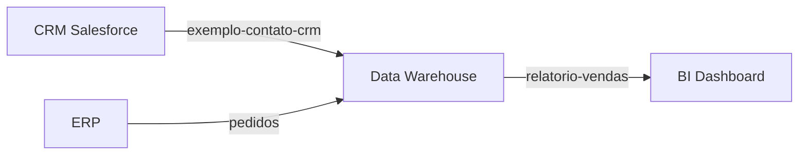

# Data Contracts

> **Contratos de dados do Portal Tech Arauz** — Integrações e ETL.
> **Versão**: 1.0.0 | **Última atualização**: 2026-01-21

---

## 1. Visão Geral

Este documento define os contratos de dados do projeto, garantindo:
- **Clareza**: Estrutura e tipos bem definidos
- **Consistência**: Padrões uniformes entre sistemas
- **Rastreabilidade**: Origem e transformações documentadas
- **Compliance**: Classificação de dados para LGPD

---

## 2. Padrão de Contrato

### 2.1 Estrutura Obrigatória

Cada contrato de dados deve conter:

```yaml
contract:
  name: string          # Nome único do contrato
  version: semver       # Versão semântica (1.0.0)
  owner: string         # Time/pessoa responsável
  description: string   # Descrição do propósito

source:
  system: string        # Sistema de origem
  entity: string        # Entidade/tabela de origem
  frequency: string     # real-time | hourly | daily | on-demand

target:
  system: string        # Sistema de destino
  entity: string        # Entidade/tabela de destino

schema:
  fields: []            # Lista de campos (ver 2.2)

quality:
  rules: []             # Regras de validação
  sla: object           # SLAs de qualidade

metadata:
  classification: string # PII | sensitive | internal | public
  retention: string      # Política de retenção
  created_at: datetime
  updated_at: datetime
```

### 2.2 Definição de Campos

```yaml
fields:
  - name: string              # Nome do campo
    type: string              # Tipo de dado (string, int, float, bool, datetime, json)
    required: boolean         # Obrigatório?
    nullable: boolean         # Aceita null?
    description: string       # Descrição do campo
    classification: string    # PII | sensitive | internal | public
    transform: string         # Transformação aplicada (se houver)
    validation: string        # Regex ou regra de validação
    example: any              # Exemplo de valor
```

---

## 3. Contratos do Projeto

### 3.1 Contrato: tarefas_sincronizacao

```yaml
contract:
  name: "tarefas-sincronizacao"
  version: "1.0.0"
  owner: "time-ti"
  description: "Configuração de tarefas de sincronização com o Espaider"

source:
  system: "portal-tech-arauz"
  entity: "tarefas_sincronizacao"
  frequency: "on-demand"

target:
  system: "portal-tech-arauz"
  entity: "tarefas_sincronizacao"

schema:
  fields:
    - name: id
      type: uuid
      required: true
      nullable: false
      description: "Identificador único da tarefa"
      classification: internal

    - name: nome
      type: string
      required: true
      nullable: false
      description: "Nome da tarefa"
      classification: internal

    - name: descricao
      type: string
      required: false
      nullable: true
      description: "Descrição da tarefa"
      classification: internal

    - name: tipo
      type: string
      required: true
      nullable: false
      description: "Tipo da fonte: espaider, webhook, custom"
      classification: internal

    - name: endpoint
      type: string
      required: false
      nullable: true
      description: "Endpoint customizado (quando aplicável)"
      classification: internal

    - name: frequencia
      type: string
      required: true
      nullable: false
      description: "Frequência: manual, diaria, semanal, mensal, custom"
      classification: internal

    - name: horario
      type: time
      required: false
      nullable: true
      description: "Horário de execução"
      classification: internal

    - name: dias_semana
      type: int_array
      required: false
      nullable: true
      description: "Dias da semana (0=Dom, 6=Sab)"
      classification: internal

    - name: dia_mes
      type: int
      required: false
      nullable: true
      description: "Dia do mês para execução"
      classification: internal

    - name: ativo
      type: bool
      required: true
      nullable: false
      description: "Ativa/desativa a tarefa"
      classification: internal

    - name: config
      type: json
      required: true
      nullable: false
      description: "Configurações adicionais da tarefa"
      classification: internal

    - name: ultima_execucao
      type: datetime
      required: false
      nullable: true
      description: "Última execução registrada"
      classification: internal

    - name: proxima_execucao
      type: datetime
      required: false
      nullable: true
      description: "Próxima execução agendada"
      classification: internal

    - name: api_id
      type: uuid
      required: false
      nullable: true
      description: "Referência para API configurada"
      classification: internal

    - name: cron_schedule
      type: string
      required: false
      nullable: true
      description: "Expressão cron para execução custom"
      classification: internal

    - name: timezone
      type: string
      required: true
      nullable: false
      description: "Timezone da execução"
      classification: internal

    - name: prioridade
      type: int
      required: true
      nullable: false
      description: "Prioridade (1=alta, 10=baixa)"
      classification: internal

quality:
  rules:
    - name: "nome_not_empty"
      type: "not_null"
      field: "nome"
      threshold: 1.0

  sla:
    freshness_hours: 24
    completeness_percent: 99

metadata:
  classification: internal
  retention: "5 years"
  created_at: "2026-01-19T00:00:00Z"
  updated_at: "2026-01-21T00:00:00Z"
```

### 3.2 Contrato: logs_execucao

```yaml
contract:
  name: "logs-execucao"
  version: "1.0.0"
  owner: "time-ti"
  description: "Histórico de execuções de sincronização"

source:
  system: "portal-tech-arauz"
  entity: "logs_execucao"
  frequency: "on-demand"

target:
  system: "portal-tech-arauz"
  entity: "logs_execucao"

schema:
  fields:
    - name: id
      type: uuid
      required: true
      nullable: false
      description: "Identificador do log"
      classification: internal

    - name: tarefa_id
      type: uuid
      required: false
      nullable: true
      description: "Referência à tarefa de sincronização"
      classification: internal

    - name: status
      type: string
      required: true
      nullable: false
      description: "executando, sucesso, erro, cancelado, parcial"
      classification: internal

    - name: registros_processados
      type: int
      required: true
      nullable: false
      description: "Total de registros processados"
      classification: internal

    - name: registros_novos
      type: int
      required: true
      nullable: false
      description: "Total de registros novos"
      classification: internal

    - name: registros_atualizados
      type: int
      required: true
      nullable: false
      description: "Total de registros atualizados"
      classification: internal

    - name: registros_erros
      type: int
      required: true
      nullable: false
      description: "Total de registros com erro"
      classification: internal

    - name: mensagem_erro
      type: string
      required: false
      nullable: true
      description: "Mensagem de erro (sanitizada na view safe)"
      classification: sensitive

    - name: detalhes
      type: json
      required: true
      nullable: false
      description: "Detalhes técnicos (admin only)"
      classification: sensitive

    - name: duracao_ms
      type: int
      required: false
      nullable: true
      description: "Duração em ms"
      classification: internal

    - name: iniciado_em
      type: datetime
      required: true
      nullable: false
      description: "Início da execução"
      classification: internal

    - name: finalizado_em
      type: datetime
      required: false
      nullable: true
      description: "Fim da execução"
      classification: internal

quality:
  rules:
    - name: "status_not_empty"
      type: "not_null"
      field: "status"
      threshold: 1.0

metadata:
  classification: internal
  retention: "1 year"
  created_at: "2026-01-19T00:00:00Z"
  updated_at: "2026-01-21T00:00:00Z"
```

### 3.3 Contrato: solicitacoes (campos Espaider)

```yaml
contract:
  name: "solicitacoes-espaider"
  version: "1.0.0"
  owner: "time-ti"
  description: "Campos de integração com Espaider em solicitacoes"

source:
  system: "espaider"
  entity: "solicitacoes"
  frequency: "daily"

target:
  system: "portal-tech-arauz"
  entity: "solicitacoes"

schema:
  fields:
    - name: id_espaider
      type: int
      required: false
      nullable: true
      description: "ID original no Espaider"
      classification: internal

    - name: codigo_espaider
      type: string
      required: false
      nullable: true
      description: "Código formatado no Espaider"
      classification: internal

    - name: origem
      type: string
      required: true
      nullable: false
      description: "manual, espaider, api"
      classification: internal

    - name: sincronizado_em
      type: datetime
      required: false
      nullable: true
      description: "Data/hora da última sincronização"
      classification: internal

quality:
  rules:
    - name: "origem_enum"
      type: "enum"
      field: "origem"
      values: ["manual", "espaider", "api"]
      threshold: 1.0

metadata:
  classification: internal
  retention: "5 years"
  created_at: "2026-01-19T00:00:00Z"
  updated_at: "2026-01-21T00:00:00Z"
```

### 3.4 Contrato: espaider_field_mapping

```yaml
contract:
  name: "espaider-field-mapping"
  version: "1.0.0"
  owner: "time-ti"
  description: "Mapeamento de campos entre API Espaider e sistema"

source:
  system: "portal-tech-arauz"
  entity: "espaider_field_mapping"
  frequency: "on-demand"

target:
  system: "portal-tech-arauz"
  entity: "espaider_field_mapping"

schema:
  fields:
    - name: campo_espaider
      type: string
      required: true
      nullable: false
      description: "Nome do campo no Espaider"
      classification: internal

    - name: campo_sistema
      type: string
      required: true
      nullable: false
      description: "Nome do campo no sistema"
      classification: internal

    - name: tabela_lookup
      type: string
      required: false
      nullable: true
      description: "Tabela de lookup associada"
      classification: internal

    - name: transformacao
      type: string
      required: false
      nullable: true
      description: "Transformação aplicada"
      classification: internal

    - name: ativo
      type: bool
      required: true
      nullable: false
      description: "Registro ativo"
      classification: internal

quality:
  rules:
    - name: "campo_espaider_not_empty"
      type: "not_null"
      field: "campo_espaider"
      threshold: 1.0

metadata:
  classification: internal
  retention: "5 years"
  created_at: "2026-01-21T00:00:00Z"
  updated_at: "2026-01-21T00:00:00Z"
```

---

## 4. Transformações Padrão

### 4.1 Funções de Transformação

| Função | Descrição | Exemplo |
|--------|-----------|---------|
| `trim(value)` | Remove espaços | " texto " → "texto" |
| `lowercase(value)` | Converte para minúsculas | "TEXTO" → "texto" |
| `uppercase(value)` | Converte para maiúsculas | "texto" → "TEXTO" |
| `to_utc(value)` | Converte para UTC | "2026-01-18T10:00:00-03:00" → "2026-01-18T13:00:00Z" |
| `mask_pii(value)` | Mascara PII | "joao@email.com" → "j***@e***.com" |
| `hash_sha256(value)` | Hash SHA256 | "texto" → "hash..." |
| `default(value, default)` | Valor padrão se null | null → "N/A" |

### 4.2 Composição de Transformações

```yaml
transform: "lowercase(trim(value))"  # Aplicado em ordem: trim primeiro, depois lowercase
```

---

## 5. Regras de Qualidade

### 5.1 Tipos de Validação

| Tipo | Descrição | Parâmetros |
|------|-----------|------------|
| `not_null` | Campo não pode ser null | threshold |
| `uniqueness` | Valores únicos | threshold |
| `regex` | Valida contra regex | pattern, threshold |
| `range` | Valor dentro de range | min, max, threshold |
| `enum` | Valor em lista permitida | values, threshold |
| `referential` | Referência existe | target_system, target_field |

### 5.2 Thresholds

- **1.0 (100%)**: Regra deve passar em todos os registros
- **0.99 (99%)**: Tolera até 1% de falhas
- **0.95 (95%)**: Tolera até 5% de falhas

---

## 6. Classificação de Dados (LGPD)

### 6.1 Categorias

| Classificação | Descrição | Controles Obrigatórios |
|---------------|-----------|------------------------|
| **PII** | Identifica pessoa física | Criptografia, acesso restrito, logs |
| **sensitive** | Dados confidenciais de negócio | Acesso restrito, logs |
| **internal** | Dados operacionais | Autenticação |
| **public** | Dados públicos | Nenhum |

### 6.2 Tratamento por Classificação

```yaml
# PII - Tratamento obrigatório
- Criptografia em repouso (AES-256)
- Criptografia em trânsito (TLS 1.3)
- Mascaramento em logs
- Acesso auditado
- Retenção conforme LGPD

# Sensitive - Tratamento recomendado
- Criptografia em trânsito
- Acesso restrito por papel
- Logs de acesso
```

---

## 7. Versionamento de Contratos

### 7.1 Política de Versão

- **MAJOR (X.0.0)**: Breaking changes (remoção de campos, mudança de tipo)
- **MINOR (0.X.0)**: Novos campos opcionais, novas transformações
- **PATCH (0.0.X)**: Correções de documentação, ajustes de threshold

### 7.2 Compatibilidade

| Mudança | Compatível? | Ação Necessária |
|---------|-------------|-----------------|
| Adicionar campo opcional | ✅ Sim | MINOR bump |
| Adicionar campo obrigatório | ❌ Não | MAJOR bump + migração |
| Remover campo | ❌ Não | MAJOR bump + depreciação |
| Mudar tipo de campo | ❌ Não | MAJOR bump + migração |
| Mudar transformação | ⚠️ Depende | Avaliar impacto |

### 7.3 Processo de Mudança

1. Propor mudança em ADR
2. Avaliar impacto nos consumidores
3. Comunicar stakeholders
4. Implementar com período de transição
5. Depreciar versão anterior

---

## 8. SLAs de Dados

### 8.1 Métricas Padrão

| Métrica | Descrição | Target Padrão |
|---------|-----------|---------------|
| **Freshness** | Atraso máximo dos dados | < 2 horas |
| **Completeness** | % de registros completos | > 99% |
| **Accuracy** | % de dados corretos | > 99% |
| **Availability** | Uptime do pipeline | > 99.5% |

### 8.2 Alertas

```yaml
alerts:
  - name: "freshness_breach"
    condition: "freshness_hours > sla.freshness_hours"
    severity: "high"
    notify: ["data-team@empresa.com"]

  - name: "quality_degradation"
    condition: "completeness_percent < 95"
    severity: "critical"
    notify: ["data-team@empresa.com", "cto@empresa.com"]
```

---

## 9. Registro de Contratos

### 9.1 Inventário

| Contrato | Versão | Source | Target | Classificação | Status |
|----------|--------|--------|--------|---------------|--------|
| tarefas-sincronizacao | 1.0.0 | Portal | Portal | internal | Ativo |
| logs-execucao | 1.0.0 | Portal | Portal | internal | Ativo |
| solicitacoes-espaider | 1.0.0 | Espaider | Portal | internal | Ativo |
| espaider-field-mapping | 1.0.0 | Portal | Portal | internal | Ativo |

### 9.2 Dependências



---

## Histórico de Atualizações

| Data | Autor | Mudança |
|------|-------|---------|
| 2026-01-21 | AI Assistant | Contratos alinhados às migrations do Supabase |
