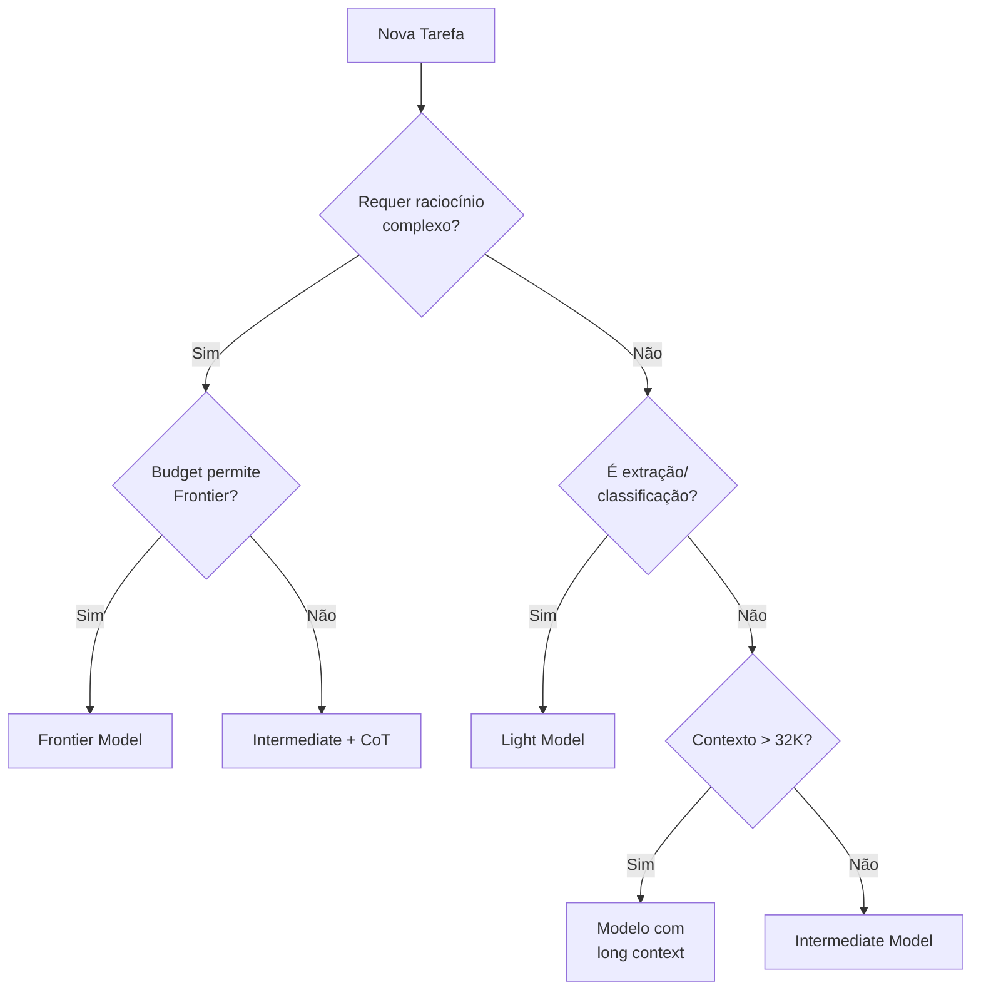

# Guia de Seleção de Modelos LLM

> **Template padrão tech-agentes** — Critérios e recomendações para escolha de modelos.
> **Versão**: 1.0.0 | **Última atualização**: 2026-01-18

---

## 1. Visão Geral

Este guia orienta a seleção de modelos de linguagem (LLMs) para cada tipo de tarefa, considerando:
- **Performance**: Qualidade da resposta
- **Latência**: Tempo de resposta
- **Custo**: Preço por token
- **Context Window**: Tamanho máximo de contexto
- **Capabilities**: Funcionalidades específicas

---

## 2. Classificação de Tarefas

### 2.1 Classes de Tarefa

| Classe | Descrição | Exemplos | Modelo Recomendado |
|--------|-----------|----------|-------------------|
| **Arquitetura/Raciocínio Complexo** | Decisões de design, análise profunda | ADRs, code review, planejamento | Frontier (GPT-5.2 Codex, Opus 4.5, Sonnet 4.5) |
| **Geração Estruturada** | Código, documentação, templates | Geração de código, docs técnicos | Intermediate (Sonnet 4.5, GPT-4o) |
| **Extração/Classificação** | Parsing, NER, classificação | Extrair dados de texto, categorizar | Light (GPT-4o-mini) |
| **Conversação** | Chat, suporte | Atendimento, Q&A | Intermediate |
| **Embedding/Busca** | Vetorização, similaridade | RAG, busca semântica | Modelos de embedding específicos |

### 2.2 Matriz de Decisão

```
                    ┌─────────────────────────────────────────┐
                    │           Complexidade da Tarefa         │
                    │    Baixa        Média         Alta       │
    ┌───────────────┼─────────────────────────────────────────┤
    │ Custo         │                                         │
    │ Sensível      │   Light      Light/Inter    Inter       │
    │               │                                         │
    │ Balanceado    │   Light      Intermediate  Inter/Front │
    │               │                                         │
    │ Qualidade     │   Inter      Intermediate  Frontier    │
    │ Crítica       │                                         │
    └───────────────┴─────────────────────────────────────────┘
```

---

## 3. Catálogo de Modelos

### 3.1 Modelos Frontier (Máxima Qualidade)

| Modelo | Provider | Context | Custo (aprox.) | Melhor Para |
|--------|----------|---------|----------------|-------------|
| GPT-5.2 Codex | OpenAI | 200K+ | $$$$ | Raciocínio avançado, código crítico |
| Opus 4.5 | Anthropic | 200K+ | $$$$ | Análise profunda, compliance |
| Sonnet 4.5 | Anthropic | 200K+ | $$$ | Alta qualidade com melhor custo |
| GPT-4o | OpenAI | 128K | $$$ | Multimodal, uso geral |

### 3.2 Modelos Intermediate (Balanceados)

| Modelo | Provider | Context | Custo (aprox.) | Melhor Para |
|--------|----------|---------|----------------|-------------|
| Sonnet 4.5 | Anthropic | 200K+ | $$$ | Melhor custo x benefício para geração estruturada |
| GPT-4o | OpenAI | 128K | $$$ | Qualidade com latência estável |
| GPT-4o-mini | OpenAI | 128K | $$ | Volume alto, custo reduzido |

### 3.3 Modelos Light (Baixo Custo)

| Modelo | Provider | Context | Custo (aprox.) | Melhor Para |
|--------|----------|---------|----------------|-------------|
| GPT-4o-mini | OpenAI | 128K | $ | Classificação, parsing |
| Sonnet 4.5 | Anthropic | 200K+ | $$ | Fallback de qualidade quando necessário |

### 3.4 Modelos de Embedding

| Modelo | Provider | Dimensões | Melhor Para |
|--------|----------|-----------|-------------|
| text-embedding-3-large | OpenAI | 3072 | Alta precisão |
| text-embedding-3-small | OpenAI | 1536 | Custo-benefício |
| voyage-large-2 | Voyage | 1024 | Código e texto técnico |

---

## 4. Configurações por Tarefa

### 4.1 Parâmetros Recomendados

| Tarefa | Temperature | Top-P | Max Tokens | Formato |
|--------|-------------|-------|------------|---------|
| Extração de dados | 0.0-0.1 | 1.0 | Variável | JSON strict |
| Geração de código | 0.1-0.3 | 0.95 | Variável | Code block |
| Análise/Decisão | 0.2-0.4 | 0.9 | 2000+ | Markdown |
| Criatividade | 0.7-1.0 | 0.95 | Variável | Livre |
| Conversação | 0.5-0.7 | 0.9 | 500-1000 | Natural |

### 4.2 Referência em configs/modelos.json

```json
{
  "version": "1.0.0",
  "defaults": {
    "architecture": { "temperature": 0.2, "top_p": 0.9 },
    "extraction": { "temperature": 0.1, "top_p": 1.0 },
    "controlled_generation": { "temperature": 0.5, "top_p": 0.95 }
  },
  "routing": [
    {
      "task_class": "architecture|compliance|context_long",
      "preferred": ["gpt-5.2-codex", "opus-4.5", "sonnet-4.5"],
      "fallback": ["gpt-4o", "gpt-4o-mini"],
      "max_temperature": 0.3
    }
  ]
}
```

---

## 5. Critérios de Seleção

### 5.1 Árvore de Decisão



### 5.2 Checklist de Avaliação

```markdown
## Checklist de Seleção de Modelo

### Requisitos da Tarefa
- [ ] Qual a complexidade do raciocínio necessário?
- [ ] Qual o tamanho médio do contexto de entrada?
- [ ] Qual o formato de saída esperado?
- [ ] Qual a latência máxima aceitável?
- [ ] Qual o volume esperado de requisições?

### Restrições
- [ ] Há limitação de budget?
- [ ] Há requisitos de compliance (dados on-premise)?
- [ ] Há requisitos de latência rígidos?

### Avaliação
- [ ] Golden sets testados com o modelo?
- [ ] Métricas de qualidade registradas?
- [ ] Custo estimado dentro do budget?
```

---

## 6. Estratégias de Otimização

### 6.1 Redução de Custos

| Estratégia | Descrição | Economia Estimada |
|------------|-----------|-------------------|
| **Routing Inteligente** | Usar Light para tarefas simples | 40-60% |
| **Caching** | Cache de respostas idênticas | 20-40% |
| **Batching** | Agrupar requisições | 10-20% |
| **Prompt Compression** | Reduzir tamanho do contexto | 10-30% |
| **Output Limits** | Limitar tokens de saída | 5-15% |

### 6.2 Melhoria de Qualidade

| Estratégia | Descrição | Quando Usar |
|------------|-----------|-------------|
| **Chain-of-Thought** | Pedir raciocínio passo-a-passo | Tarefas complexas |
| **Few-shot Examples** | Incluir exemplos no prompt | Formatação específica |
| **Self-Consistency** | Múltiplas gerações + votação | Decisões críticas |
| **Structured Output** | JSON schema no prompt | Extração de dados |
| **Grounding** | Fornecer contexto factual | Evitar alucinação |

### 6.3 Redução de Latência

| Estratégia | Descrição | Redução Estimada |
|------------|-----------|------------------|
| **Streaming** | Processar tokens incrementalmente | UX melhor |
| **Parallel Calls** | Requisições simultâneas | 50-70% |
| **Modelo mais leve** | Usar Light quando possível | 60-80% |
| **Prompt mais curto** | Reduzir contexto | 20-40% |

---

## 7. Fallback e Resiliência

### 7.1 Estratégia de Fallback

```yaml
fallback_policy:
  primary: "gpt-5.2-codex"
  fallbacks:
    - model: "sonnet-4.5"
      condition: "primary_unavailable OR latency > 10s"
    - model: "gpt-4o"
      condition: "quality_degradation OR cost_spike"
    - model: "gpt-4o-mini"
      condition: "all_premium_unavailable"

  retry:
    max_attempts: 3
    backoff: "exponential"
    initial_delay_ms: 1000
```

### 7.2 Monitoramento

```yaml
alerts:
  - name: "model_degradation"
    condition: "error_rate > 5% OR latency_p95 > 15s"
    action: "switch_to_fallback"
    notify: ["devops@empresa.com"]

  - name: "cost_spike"
    condition: "daily_cost > budget * 1.2"
    action: "alert_only"
    notify: ["cto@empresa.com"]
```

---

## 8. Compliance e Segurança

### 8.1 Considerações por Provider

| Provider | Data Residency | SOC2 | HIPAA | GDPR |
|----------|----------------|------|-------|------|
| OpenAI (API) | US | ✅ | ❌ | ✅ |
| Azure OpenAI | Configurável | ✅ | ✅ | ✅ |
| Anthropic | US | ✅ | ❌ | ✅ |
| Google Cloud | Configurável | ✅ | ✅ | ✅ |

### 8.2 Dados Sensíveis

```markdown
## Regras para Dados Sensíveis

- NUNCA enviar PII para modelos de terceiros sem consentimento
- Preferir Azure OpenAI ou modelos on-premise para dados sensíveis
- Mascarar/anonimizar PII quando possível
- Documentar base legal para tratamento em LLMs
```

---

## 9. Avaliação e Benchmarks

### 9.1 Métricas de Avaliação

| Métrica | Descrição | Como Medir |
|---------|-----------|------------|
| **Accuracy** | Respostas corretas | Golden sets |
| **Faithfulness** | Fidelidade ao contexto | Human eval |
| **Relevance** | Relevância da resposta | Human eval |
| **Latency** | Tempo de resposta | P50, P95 |
| **Cost per task** | Custo por tarefa | Tokens × preço |

### 9.2 Processo de Benchmark

1. Definir golden set representativo (mínimo 50 casos)
2. Executar com candidatos a modelo
3. Avaliar métricas (automated + human)
4. Comparar custo-benefício
5. Documentar decisão em ADR

### 9.3 Registro de Avaliações

| Modelo | Tarefa | Accuracy | Latency P95 | Cost/1K | Data | Decisão |
|--------|--------|----------|-------------|---------|------|---------|
| gpt-5.2-codex | extração | 99% | 2.0s | $0.05 | 2026-01 | ✅ Aprovado |
| sonnet-4.5 | extração | 97% | 1.6s | $0.03 | 2026-01 | ✅ Alternativa |
| gpt-4o-mini | extração | 95% | 0.8s | $0.01 | 2026-01 | ✅ Econômico |

---

## 10. Atualização de Modelos

### 10.1 Processo de Atualização

1. **Monitorar** releases dos providers
2. **Avaliar** novos modelos com golden sets
3. **Comparar** custo-benefício vs. atual
4. **Testar** em ambiente de staging
5. **Migrar** gradualmente (canary deploy)
6. **Documentar** em ADR

### 10.2 Política de Depreciação

- Manter suporte a modelo por 6 meses após depreciação do provider
- Comunicar stakeholders com 30 dias de antecedência
- Fornecer plano de migração

---

## Histórico de Atualizações

| Data | Autor | Mudança |
|------|-------|---------|
| 2026-01-18 | CTO | Criação inicial |
