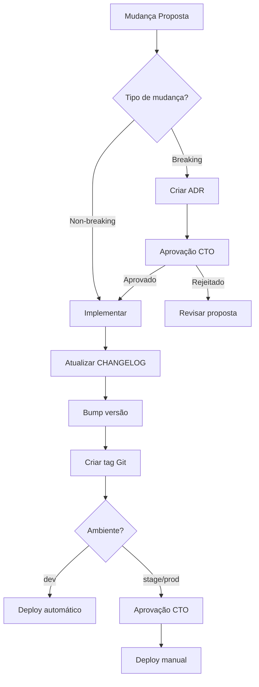
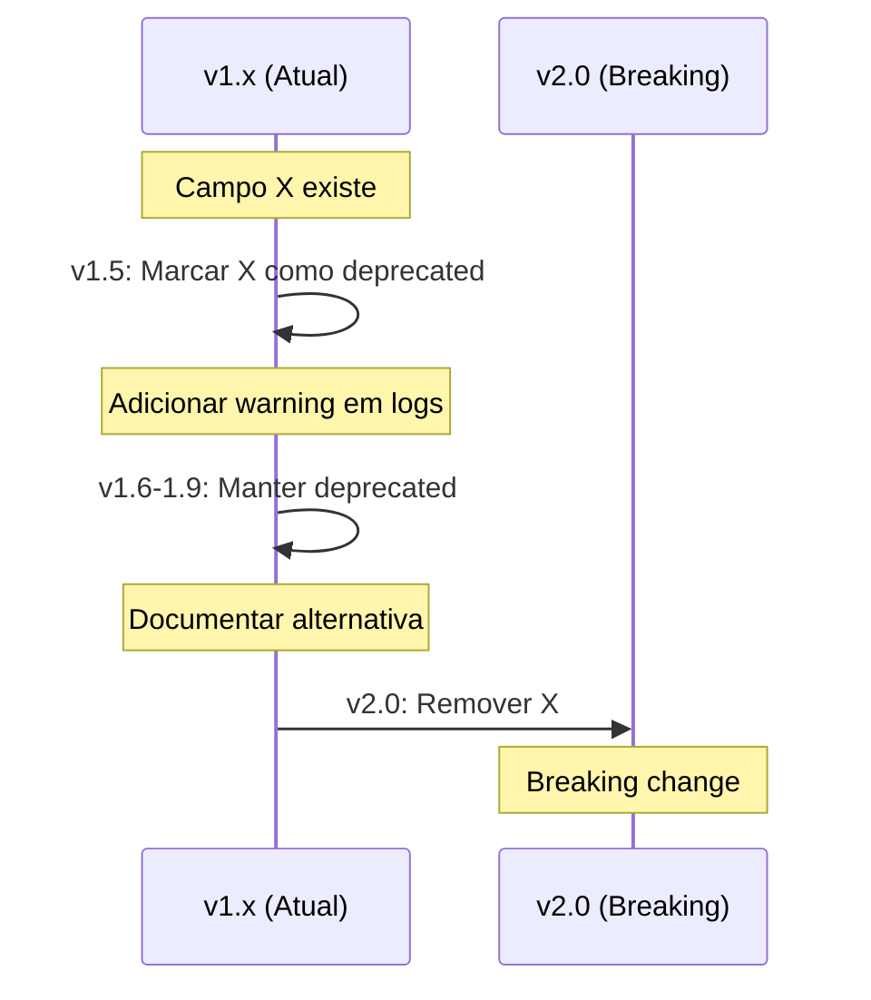
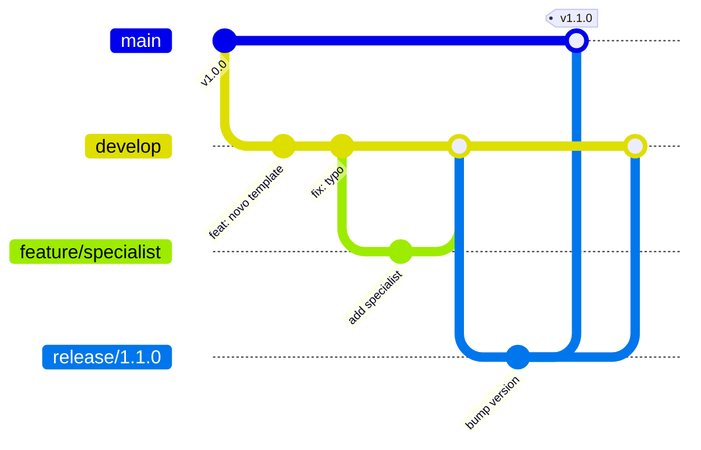

# Política de Versionamento

> **Template padrão tech-agentes** — Semver e changelog para governança de mudanças.
> **Versão**: 1.0.0 | **Última atualização**: 2026-01-18

---

## 1. Visão Geral

Este documento define a política de versionamento para todos os componentes do framework tech-agentes, garantindo rastreabilidade, compatibilidade e comunicação clara de mudanças.

### 1.1 Escopo

Componentes versionados:
- **Agentes** (`agents/*.md`)
- **Templates** (`templates/**/*.md`)
- **Prompts** (`prompts/*.md`)
- **Schemas** (mantidos no repositório da ferramenta `tech-agentes`)
- **Configurações** (`configs/*.json`)
- **Workflows** (`workflows/*.json`)
- **Políticas** (`docs/**/*.md`)

---

## 2. Semantic Versioning (Semver)

### 2.1 Formato

```
MAJOR.MINOR.PATCH

Exemplos:
- 1.0.0 → Versão inicial estável
- 1.1.0 → Adição de funcionalidade retrocompatível
- 1.1.1 → Correção de bug
- 2.0.0 → Breaking change
```

### 2.2 Regras de Incremento

| Tipo | Quando Incrementar | Exemplos |
|------|-------------------|----------|
| **MAJOR** | Breaking changes | Remoção de campo, mudança de schema, alteração de comportamento |
| **MINOR** | Novas funcionalidades retrocompatíveis | Novo campo opcional, novo template, nova rubrica |
| **PATCH** | Correções e melhorias sem impacto | Typos, clarificações, ajustes de exemplo |

### 2.3 Tabela de Decisão

| Mudança | Impacto | Versão | ADR? |
|---------|---------|--------|------|
| Adicionar campo obrigatório | Breaking | MAJOR | ✅ |
| Remover campo | Breaking | MAJOR | ✅ |
| Mudar tipo de campo | Breaking | MAJOR | ✅ |
| Mudar comportamento de agente | Breaking | MAJOR | ✅ |
| Adicionar campo opcional | Compatível | MINOR | ❌ |
| Novo template | Compatível | MINOR | ❌ |
| Nova rubrica/golden set | Compatível | MINOR | ❌ |
| Melhorar documentação | Nenhum | PATCH | ❌ |
| Corrigir exemplo | Nenhum | PATCH | ❌ |
| Ajustar threshold | Depende | MINOR/MAJOR | ⚠️ |

---

## 3. Changelog

### 3.1 Formato (Keep a Changelog)

```markdown
# Changelog

Todas as mudanças notáveis deste projeto serão documentadas neste arquivo.

O formato é baseado em [Keep a Changelog](https://keepachangelog.com/pt-BR/1.0.0/),
e este projeto adere ao [Semantic Versioning](https://semver.org/lang/pt-BR/).

## [Unreleased]

### Added
- Novos itens adicionados

### Changed
- Mudanças em funcionalidades existentes

### Deprecated
- Funcionalidades que serão removidas em versões futuras

### Removed
- Funcionalidades removidas

### Fixed
- Correções de bugs

### Security
- Correções de vulnerabilidades

## [1.0.0] - 2026-01-18

### Added
- Versão inicial do framework tech-agentes
- Agentes base: orquestrador, contexto, prompt, segurança, qa, observabilidade, devops
- Templates por categoria
- Schemas Pydantic para validação
- CLI para scaffold e validação
```

### 3.2 Regras do Changelog

1. **Obrigatório** para qualquer mudança MINOR ou MAJOR
2. **Recomendado** para PATCH se relevante para usuários
3. Usar verbos no **infinitivo** (Adicionar, Remover, Corrigir)
4. Referenciar **issues/PRs** quando aplicável
5. Manter seção **[Unreleased]** sempre no topo

### 3.3 Exemplo de Entrada

```markdown
## [1.2.0] - 2026-02-15

### Added
- Novo agente specialist: healthcare-etl-validator (#42)
- Template para runbooks de incidentes (#38)
- Golden sets para extração de dados médicos

### Changed
- Aumentado timeout padrão de 8s para 10s em configs/projeto.json
- Melhorada documentação de handoffs entre agentes

### Fixed
- Corrigido schema de ExecutionLog que não validava tenant_id vazio (#41)

### Security
- Adicionada validação de sanitização em prompts de extração (#39)
```

---

## 4. Processo de Release

### 4.1 Workflow



### 4.2 Checklist de Release

```markdown
## Checklist: Release v[X.Y.Z]

### Pré-release
- [ ] Todas as mudanças documentadas no CHANGELOG
- [ ] ADRs criados para breaking changes
- [ ] Testes passando
- [ ] Golden sets atualizados (se mudança em prompts/agentes)
- [ ] Documentação atualizada

### Release
- [ ] Versão incrementada em `pyproject.toml`
- [ ] Versão incrementada em arquivos afetados
- [ ] CHANGELOG finalizado com data
- [ ] Tag Git criada: `git tag -a v[X.Y.Z] -m "Release v[X.Y.Z]"`
- [ ] Push da tag: `git push origin v[X.Y.Z]`

### Pós-release
- [ ] Comunicar stakeholders
- [ ] Verificar deploy
- [ ] Monitorar métricas
```

---

## 5. Versionamento por Componente

### 5.1 Onde Declarar Versão

| Componente | Localização da Versão |
|------------|----------------------|
| Projeto | `pyproject.toml` → `version` |
| Configs | `configs/*.json` → campo `version` |
| Workflows | `workflows/*.json` → campo `version` |
| Agentes | Header do arquivo `.md` |
| Templates | Header do arquivo `.md` |
| Prompts | Header do arquivo `.md` |
| Schemas | Docstring da classe |

### 5.2 Exemplo de Header

```markdown
# Template: [Nome]

> **Versão**: 1.2.0
> **Última atualização**: 2026-01-18
> **Changelog**: [Link para CHANGELOG]
```

### 5.3 Sincronização de Versões

- **Projeto principal** (`pyproject.toml`): Versão master do framework
- **Componentes individuais**: Podem ter versões independentes
- **Regra**: Versão do projeto ≥ versão de qualquer componente

---

## 6. Breaking Changes

### 6.1 Política

1. **Evitar** breaking changes sempre que possível
2. **Deprecar antes** de remover (mínimo 1 versão MINOR)
3. **Documentar** plano de migração
4. **ADR obrigatório** para qualquer breaking change
5. **Comunicação** antecipada aos stakeholders

### 6.2 Processo de Depreciação



### 6.3 Comunicação de Depreciação

```markdown
## Aviso de Depreciação

**Componente**: [nome]
**Campo/Funcionalidade**: [descrição]
**Versão de depreciação**: 1.5.0
**Versão de remoção**: 2.0.0
**Alternativa**: [usar Y em vez de X]
**Migração**: [instruções]
```

---

## 7. Tags e Branches

### 7.1 Convenção de Tags

```
v[MAJOR].[MINOR].[PATCH]

Exemplos:
- v1.0.0
- v1.2.3
- v2.0.0-beta.1 (pré-release)
- v2.0.0-rc.1 (release candidate)
```

### 7.2 Branches

| Branch | Propósito | Proteção |
|--------|-----------|----------|
| `main` | Versão estável de produção | Protegida, requer PR |
| `develop` | Desenvolvimento ativo | Protegida, requer PR |
| `feature/*` | Novas funcionalidades | Não protegida |
| `fix/*` | Correções | Não protegida |
| `release/*` | Preparação de release | Protegida |

### 7.3 Fluxo Git



---

## 8. Automação

### 8.1 Validação de Versão (CI)

```yaml
# .github/workflows/version-check.yml
name: Version Check

on:
  pull_request:
    branches: [main, develop]

jobs:
  check-version:
    runs-on: ubuntu-latest
    steps:
      - uses: actions/checkout@v4

      - name: Check version bump
        run: |
          # Verificar se versão foi incrementada
          # Verificar se CHANGELOG foi atualizado
          # Verificar se ADR existe para breaking changes
```

### 8.2 Geração Automática de Tag

```yaml
# .github/workflows/release.yml
name: Release

on:
  push:
    branches: [main]

jobs:
  release:
    runs-on: ubuntu-latest
    steps:
      - uses: actions/checkout@v4

      - name: Get version
        id: version
        run: echo "VERSION=$(python -c 'import tomllib; print(tomllib.load(open(\"pyproject.toml\", \"rb\"))[\"project\"][\"version\"])')" >> $GITHUB_OUTPUT

      - name: Create tag
        run: |
          git tag v${{ steps.version.outputs.VERSION }}
          git push origin v${{ steps.version.outputs.VERSION }}
```

---

## 9. Compatibilidade

### 9.1 Matriz de Compatibilidade

| tech-agentes | Python | Pydantic | Cursor |
|--------------|--------|----------|--------|
| 1.x | ≥3.11 | ≥2.7 | ≥0.40 |
| 2.x | ≥3.12 | ≥2.9 | ≥0.45 |

### 9.2 Política de Suporte

| Versão | Status | Suporte até |
|--------|--------|-------------|
| 1.x | LTS | 2027-01-01 |
| 2.x | Current | Ativo |
| 0.x | EOL | Sem suporte |

---

## Histórico de Atualizações

| Data | Autor | Mudança |
|------|-------|---------|
| 2026-01-18 | CTO | Criação da política |
