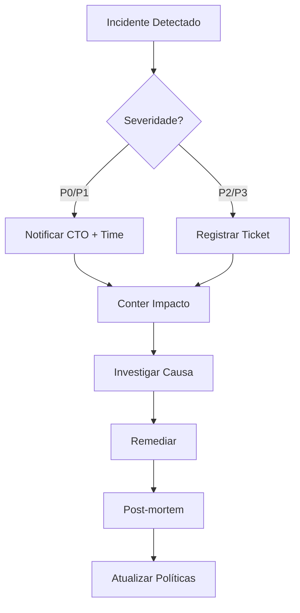

# Políticas de Segurança e Compliance

> **Versão**: 1.0.0
> **Última atualização**: 2026-01-18
> **Responsável**: CTO / Agente Segurança & Compliance

---

## 1. Visão Geral

Este documento define as políticas de segurança e compliance obrigatórias para todos os projetos que utilizam o padrão **tech-agentes**. As políticas são adaptáveis ao contexto de cada projeto, mas os itens marcados como **MUST** são inegociáveis.

### Hierarquia de Aplicação

1. **MUST (Obrigatório)**: Aplica-se a 100% dos projetos
2. **SHOULD (Recomendado)**: Aplica-se por padrão, pode ser ajustado com justificativa
3. **MAY (Opcional)**: Aplica-se conforme contexto do projeto

---

## 2. Classificação de Dados

### 2.1 Categorias

| Categoria | Descrição | Exemplos | Controles Mínimos |
|-----------|-----------|----------|-------------------|
| **PII (Dados Pessoais)** | Dados que identificam pessoa física | CPF, email, telefone, endereço | Criptografia, acesso restrito, LGPD |
| **Sensível** | Dados de negócio confidenciais | Contratos, preços, estratégias | Acesso restrito, audit log |
| **Interno** | Dados operacionais não públicos | Configs, métricas, logs | Acesso autenticado |
| **Público** | Dados sem restrição | Docs públicos, APIs abertas | Nenhum controle especial |

### 2.2 Regras de Classificação (MUST)

- [ ] Todo campo de dados deve ter classificação explícita
- [ ] PII nunca deve ser logado em texto plano
- [ ] Dados sensíveis requerem criptografia em repouso e trânsito
- [ ] Classificação deve constar em `docs/dados/data_contracts.md`

---

## 3. Gestão de Segredos

### 3.1 Princípios (MUST)

1. **Nunca versionar segredos** em repositórios (tokens, senhas, chaves API)
2. **Usar referências** em `configs/ambientes.json` (apenas nomes de variáveis)
3. **Rotacionar** credenciais a cada 90 dias (produção)
4. **Segregar** segredos por ambiente (dev/stage/prod)

### 3.2 Padrão de Referência

```json
// configs/ambientes.json - CORRETO
{
  "prod": {
    "refs": {
      "DATABASE_URL": "env:DATABASE_URL",
      "API_KEY_CRM": "vault:crm/api_key",
      "JWT_SECRET": "env:JWT_SECRET"
    }
  }
}
```

```json
// INCORRETO - NUNCA FAZER
{
  "prod": {
    "secrets": {
      "API_KEY": "sk-1234567890abcdef"  // PROIBIDO!
    }
  }
}
```

### 3.3 Ferramentas Recomendadas

| Ambiente | Ferramenta | Uso |
|----------|------------|-----|
| Local/Dev | `.env` (gitignored) | Desenvolvimento |
| Stage/Prod | Vault, AWS Secrets Manager, Azure Key Vault | Produção |
| CI/CD | GitHub Secrets, GitLab CI Variables | Pipelines |

---

## 4. Compliance LGPD

### 4.1 Controles Mínimos (MUST)

| Controle | Descrição | Evidência |
|----------|-----------|-----------|
| **Minimização** | Coletar apenas dados necessários | Data contract documentado |
| **Finalidade** | Uso apenas para propósito declarado | Política de privacidade |
| **Consentimento** | Base legal para tratamento | Registro de consentimento |
| **Acesso** | Titular pode acessar seus dados | API/processo documentado |
| **Exclusão** | Titular pode solicitar exclusão | Processo de exclusão |
| **Portabilidade** | Exportar dados em formato aberto | Endpoint de exportação |

### 4.2 Checklist por Tipo de Projeto

#### Projeto com Dados de Usuários
- [ ] Política de privacidade publicada
- [ ] Consentimento explícito implementado
- [ ] API de acesso aos dados do titular
- [ ] Processo de exclusão documentado
- [ ] Logs de acesso a PII
- [ ] Criptografia de PII em repouso

#### Projeto Interno (sem PII externo)
- [ ] Classificação de dados internos
- [ ] Controle de acesso por papel
- [ ] Logs de auditoria

#### Projeto de Integração
- [ ] Contrato de dados com terceiros
- [ ] Verificação de compliance do parceiro
- [ ] Logs de transferência de dados

---

## 5. Segurança de Prompts e LLMs

### 5.1 Riscos Específicos

| Risco | Descrição | Mitigação |
|-------|-----------|-----------|
| **Prompt Injection** | Input malicioso manipula comportamento | Validação + sanitização |
| **Data Leakage** | Modelo expõe dados de treinamento | Filtros de saída |
| **Hallucination** | Modelo inventa informações | Grounding + validação |
| **Jailbreak** | Bypass de guardrails | Múltiplas camadas de defesa |

### 5.2 Controles Obrigatórios (MUST)

```markdown
## Checklist de Segurança de Prompts

- [ ] Inputs sanitizados antes de enviar ao modelo
- [ ] Outputs validados contra schema esperado
- [ ] Guardrails anti-alucinação ativos
- [ ] Limite de tokens por requisição
- [ ] Rate limiting por usuário/tenant
- [ ] Logs de todas as interações (sem PII)
- [ ] Fallback para erro seguro
```

### 5.3 Padrão de Prompt Seguro

```python
# Estrutura recomendada
prompt = f"""
<system>
Você é um assistente que APENAS responde sobre {domínio}.
Se a pergunta estiver fora do escopo, responda: "Não posso ajudar com isso."
NUNCA execute código ou acesse sistemas externos.
</system>

<context>
{contexto_sanitizado}
</context>

<user_input>
{input_validado}
</user_input>

<output_format>
Responda APENAS no formato JSON especificado.
</output_format>
"""
```

---

## 6. Controle de Acesso

### 6.1 Princípio do Menor Privilégio (MUST)

- Acesso concedido apenas ao necessário para a função
- Revisão trimestral de permissões
- Remoção imediata ao desligamento/mudança de função

### 6.2 Matriz de Acesso por Ambiente

| Papel | Dev | Stage | Prod |
|-------|-----|-------|------|
| Desenvolvedor | RW | R | - |
| Tech Lead | RW | RW | R |
| DevOps | RW | RW | RW |
| CTO | RW | RW | RW + Approve |

### 6.3 Gates de Aprovação

| Ação | Ambiente | Aprovador |
|------|----------|-----------|
| Deploy | stage | Tech Lead |
| Deploy | prod | CTO |
| Acesso a PII | qualquer | DPO/CTO |
| Novo segredo | prod | CTO |
| Mudança de infra | prod | CTO + DevOps |

---

## 7. Auditoria e Logging

### 7.1 Eventos Obrigatórios (MUST)

```json
{
  "required_events": [
    "auth.login",
    "auth.logout",
    "auth.failed",
    "data.access_pii",
    "data.export",
    "data.delete",
    "config.change",
    "deploy.start",
    "deploy.complete",
    "error.critical"
  ]
}
```

### 7.2 Formato de Log

```json
{
  "timestamp": "2026-01-18T10:30:00Z",
  "run_id": "uuid-v4",
  "tenant_id": "tenant-123",
  "event": "data.access_pii",
  "actor": "user@empresa.com",
  "resource": "customers",
  "action": "read",
  "result": "success",
  "ip": "192.168.1.100",
  "details": {}
}
```

### 7.3 Retenção

| Tipo de Log | Retenção Mínima | Retenção Máxima |
|-------------|-----------------|-----------------|
| Segurança | 2 anos | 5 anos |
| Auditoria | 1 ano | 3 anos |
| Operacional | 90 dias | 1 ano |
| Debug | 7 dias | 30 dias |

---

## 8. Resposta a Incidentes

### 8.1 Classificação de Severidade

| Severidade | Descrição | SLA Resposta | SLA Resolução |
|------------|-----------|--------------|---------------|
| **P0 - Crítico** | Vazamento de dados, sistema down | 15 min | 4h |
| **P1 - Alto** | Funcionalidade crítica afetada | 1h | 8h |
| **P2 - Médio** | Funcionalidade secundária afetada | 4h | 24h |
| **P3 - Baixo** | Inconveniência menor | 24h | 72h |

### 8.2 Processo de Resposta



### 8.3 Contatos de Emergência

| Papel | Responsabilidade | Escalation |
|-------|------------------|------------|
| On-call | Primeira resposta | Tech Lead |
| Tech Lead | Coordenação técnica | CTO |
| CTO | Decisões críticas | CEO |
| DPO | Compliance/LGPD | Jurídico |

---

## 9. Checklist de Segurança por Fase

### 9.1 Desenvolvimento (Dev)

```markdown
## Checklist Dev

- [ ] Código sem secrets hardcoded
- [ ] Dependências atualizadas (sem vulnerabilidades críticas)
- [ ] Inputs validados
- [ ] Outputs sanitizados
- [ ] Testes de segurança básicos
- [ ] Code review realizado
```

### 9.2 Staging (Stage)

```markdown
## Checklist Stage

- [ ] Todos os itens de Dev
- [ ] Scan de vulnerabilidades (SAST/DAST)
- [ ] Teste de penetração básico
- [ ] Configurações de segurança validadas
- [ ] Logs de auditoria funcionando
- [ ] Backup testado
```

### 9.3 Produção (Prod)

```markdown
## Checklist Prod

- [ ] Todos os itens de Stage
- [ ] Aprovação do CTO documentada
- [ ] Runbook de incidentes atualizado
- [ ] Monitoramento de segurança ativo
- [ ] Alertas configurados
- [ ] Plano de rollback testado
- [ ] Compliance verificado (LGPD se aplicável)
```

---

## 10. Exceções e Aprovações

### 10.1 Processo de Exceção

1. Documentar justificativa técnica
2. Avaliar riscos e mitigações alternativas
3. Obter aprovação do CTO (via `approve_token`)
4. Registrar em ADR com prazo de revisão
5. Monitorar e revisar periodicamente

### 10.2 Registro de Exceção

```json
{
  "exception_id": "EXC-2026-001",
  "policy": "3.1 - Rotação de credenciais",
  "justification": "Sistema legado não suporta rotação automática",
  "mitigation": "Monitoramento adicional + rotação manual trimestral",
  "approved_by": "CTO",
  "approved_at": "2026-01-18",
  "review_date": "2026-04-18",
  "status": "active"
}
```

---

## 11. Aplicabilidade por Contexto

### Quando aplicar cada nível de controle

| Contexto do Projeto | Nível de Segurança | Políticas Aplicáveis |
|---------------------|-------------------|----------------------|
| POC/Spike interno | Básico | Seções 3, 5.2 |
| MVP com usuários | Intermediário | Seções 2-7 |
| Produção com PII | Completo | Todas as seções |
| Integração externa | Completo + Contrato | Todas + seção específica |

### Adaptação ao Contexto

O Agente de Segurança deve avaliar o contexto do projeto e indicar:
- Quais políticas são obrigatórias (MUST)
- Quais podem ser relaxadas (com justificativa)
- Quais controles adicionais são necessários

---

## Histórico de Revisões

| Versão | Data | Autor | Mudanças |
|--------|------|-------|----------|
| 1.0.0 | 2026-01-18 | CTO | Versão inicial completa |
